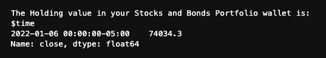
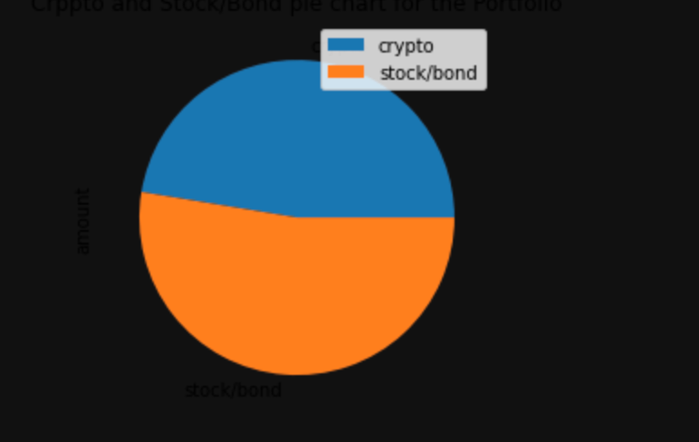

# Plan_Your_Finance
This Financial Analysis tool helps the members of Credit Union by providing the following two functionalities
1. A financial planner for emergencies. 
2.  A financial planner for retirement. This tool will forecast the performance of their retirement portfolio in 30 years. To do this, the tool will make an Alpaca API call via the Alpaca SDK to get historical price data for use in Monte Carlo simulations.

---

## Technologies

This application works on python 3.7 and uses following libraries:

* [matplotlib](https://github.com/matplotlib/matplotlib.git) - For creating static, animated, and interactive visualizations.

* [alpaca_trade_api](https://github.com/alpacahq/alpaca-trade-api-python/) - Alpaca SDK is used to interact with Alpaca stock trading API.

* [Requests](https://docs.python-requests.org/en/master/) - Provides HTTP library to make API calls

* [JSON](https://docs.python.org/3/library/json.html#module-json) - To work with standard API responses in JSON format.

* [python-dotenv]() - Used to read key-value pairs from an environment file.

---

## Installation Guide

Follow the following instructions before using the application.

```python
  pip install numpy
  pip install -U matplotlib
  pip install python-dotenv
  pip install alpaca-trade-api
 
  conda install -c anaconda requests
  conda install -c jmcmurray json
```
---

## Financial Planner For Emergencies
    The members will be able to use this tool to visualize their current savings. The members can then determine if they have enough reserves for an emergency fund.
1. Evaluate cryptocurrency wallet.
    * For prototype, we assume that the member has 1.2 bitcoins and 5.3 Ethereum in their wallet.
    * We use Python Requests library and free crypto API to get the current prices for bitcoin and Ethereum cryptocurrencies.
    
    > "https://api.alternative.me/v2/ticker/Bitcoin/?convert=USD"
    
    > "https://api.alternative.me/v2/ticker/Ethereum/?convert=USD"
    
    * The current value of the member's cryptocurrency wallet is calculated by multiplying bitcoins and ethereum values in wallet with their prices.
    
    
    
2. Evaluate the Stock and Bond Holdings. by Using the Alpaca SDK 
    * For Prototype, we assume that the member holds **100 shares of SPDR S&P 500 ETF(ticker: SPY)** and **200 shares Aggregate Bond ETF(ticker: AGG)**
    
    * In environment file (.env) we store the values of Alpaca API key and Alpaca secret key.
    
    * We use Alpaca SDK with Alpaca API key and Secret Key to get the closing prices for SPY and AGG for the most recent trading day(For Prototype we used "2022-01-06").
    
    * The total value of shares in each bond and bond portfolio is calculated by multiplying its closing price with the number of shares
    
    
    
    
    
3. Evaluate the Emergency Fund
    * We’ll use the valuations for the cryptocurrency wallet and for the stock and bond portions of the portfolio to determine if the credit union member has enough savings to build an emergency fund into their financial plan. 
    
    * We create a Pandas Dataframe with values of crytpcurrency wallet and stock and bond value and plot it in pie chart.
    
        

    * We determine if the current portfolio has enough to create an emergency fund as part of the member’s financial plan. Ideally, an emergency fund should equal to three times the member’s monthly income.

    * A variable named `emergency_fund_value` is created and set to three times the value of the member’s `monthly_income`.

    * We use three conditional statements to determine if the member’s total portfolio is large enough to fund the emergency portfolio:

        1. If the total portfolio value is greater than the emergency fund value, a message congratulating the member for having enough money in this fund is displayed.

        2. Else if the total portfolio value is equal to the emergency fund value, a message congratulating the member on reaching this important financial goal is displayed.

        3. Else the total portfolio is less than the emergency fund value, a message showing how many dollars away the member is from reaching the goal is displayed.
        
        